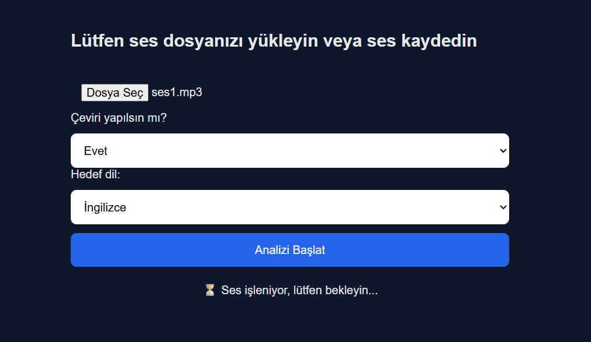
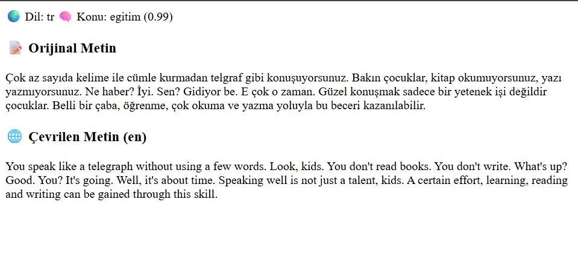

🎙️ Whisper AI – Speech to Text + Topic Detection + Translation

Bu proje, yüklenen ses dosyalarını:
📝 Metne dönüştürür (Speech-to-Text)
🌍 Otomatik dil tespiti yapar
🧠 Konu analizi yapar (Custom XLM-RoBERTa model)
🌐 İngilizce / Türkçe çeviri yapar
📩 Telegram bildirimi gönderir

Tamamen Python tabanlı bir AI web uygulamasıdır.

🚀 Özellikler
OpenAI Whisper ile ses → metin
Otomatik dil algılama
XLM-RoBERTa ile konu sınıflandırma
Türkçe eğitilmiş özel topic modeli
İngilizce / Türkçe çeviri
Telegram bot entegrasyonu
Web tabanlı arayüz

.mp3 / .wav / .webm / .m4a destekler

🧠 Kullanılan Modeller
🎙️ Whisper (medium)
Ses dosyasını metne çevirir ve dili tespit eder.
🧠 XLM-RoBERTa (Custom Fine-Tuned Model)

Eğitilmiş konu etiketleri:

egitim
finans
gunluk
hukuk
saglik
teknik
yazilim

📦 Kurulum
1️⃣ Projeyi Klonla
git clone https://github.com/kullaniciadi/proje-adi.git
cd proje-adi

2️⃣ Virtual Environment Oluştur
python -m venv venv
venv\Scripts\activate

3️⃣ Gerekli Kütüphaneleri Kur
pip install -r requirements.txt
Ayrıca sistemde FFmpeg kurulu olmalı.

▶️ Projeyi Çalıştırma
python server.py

Tarayıcıdan aç:
http://localhost:8001

📂 Proje Yapısı
📁 whisper-main
 ├── server.py
 ├── models/
 │    └── topic_model_final/
 ├── venv/
 ├── README.md

🔄 Çalışma Akışı

Kullanıcı ses dosyası yükler
FFmpeg → WAV dönüştürme
Whisper → Metin + Dil
XLM-RoBERTa → Konu Tahmini
(Opsiyonel) Çeviri
Telegram bildirimi
Sonuç web arayüzünde gösterilir

📸 Örnek Çıktı
Dil: tr
Konu: egitim (0.99)
Metin: "..."

🔐 Güvenlik Notu
Telegram bot token'ınızı public repoda paylaşmayın.
.env dosyası kullanmanız önerilir.

🛠️ Geliştirme Planı
 Duygu analizi ekleme
 REST API yapısına geçiş (FastAPI)
 Docker desteği
 Gerçek zamanlı ses akışı
 Model optimizasyonu

👩‍💻 Geliştirici
Yeliz 🚀
AI & NLP Projects
## 📸 Uygulama Görselleri

### 🎙️ Ana Arayüz

---

### 🧠 Analiz Sonucu

